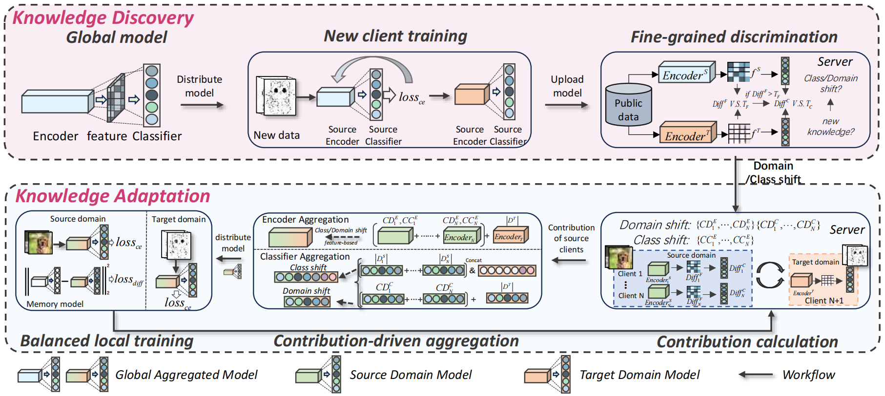

# Gains: Fine-grained Federated Domain Adaptation in Open Set
Welcome to the repository! This is the detailed implementation of our project, Gains. We hope this code will serve as a valuable resource for understanding our work and its application. Thank you for your interest and support!

## Dependencies
```
torch==2.2.1+cu121
numpy==1.24.3
scikit-learn==1.3.2
objgraph==3.6.1
pandas==2.0.2
torchvision==0.17.0+cu121
joblib==1.3.2
transformers==4.37.2
```
## Datasets
### Image Datasets
-[DigitFive](https://ai.bu.edu/M3SDA) composed by MNIST, MNISTM, SVHN, USPS, and SythDigits 
-[Amazon Review](https://nijianmo.github.io/amazon/index.html) composed by Books, DVDs, Electronics, and Kitchen housewares


## Quick start

```angular2html
python main.py --paradigm='pretrain' --mild_domain='mnist' --global_epoch=100 --shift='mild' --data='digitfive' --num_user=50
```

```angular2html
python main.py --paradigm='ours' --mild_domain='mnist' --global_epoch=100 --shift='mild' --data='digitfive' --num_user=50
```

